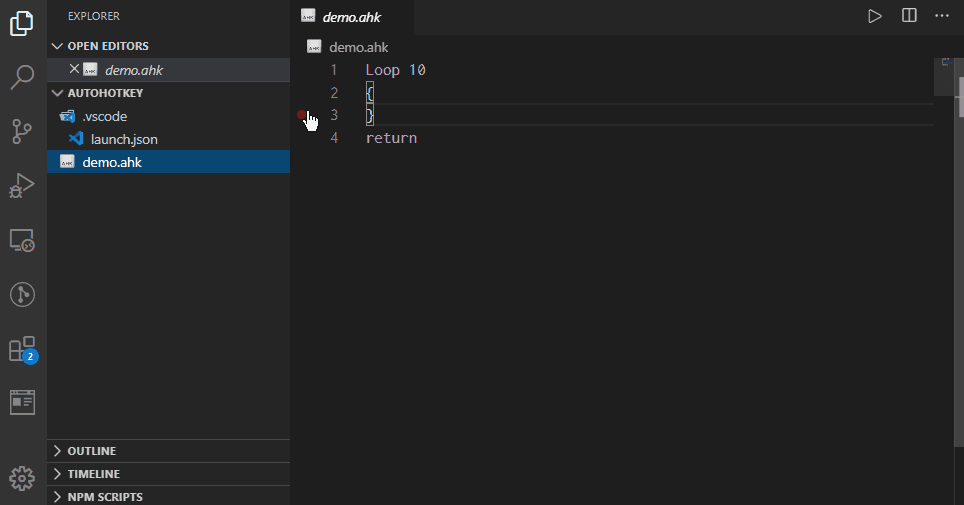

# Before reading
Please note the following first.
* This document has been translated from Japanese to English by Google Translate.
* This extension alone will not work. You will need to separately install an extension that supports AutoHotkey syntax highlighting. If you are using AutoHotkey v2 you should look for an extension that supports ah2 and ahk2.

# Overview
I made it for the purpose of replacing the debugger of Scite4AutoHotkey.
So you can use all the features it can.
In addition to that, I am implementing new features such as conditional breakpoints.
All features can be found in [`Features`](#features).

# Installation
1. Please install [AutoHotkey](https://www.autohotkey.com/)
2. Install an extension that supports AutoHotkey (most famous is `slevesque.vscode-autohotkey`)
3. Press `F1`, type `ext install zero-plusplus.vscode-autohotkey-debug`

# Features
## Data inspection


### Set value


The value of the variable can be rewritten. (Primitive value only)
Specifically, the following types are supported.
* `String` e.g `"string"`
* `Number`
    * `Integer` Treated as a intger. e.g. `123`
    * `Float` Treated as a string. v2 is an intger. e.g. `123.456`
    * `Hex` Converted to decimal and treated as integer. e.g. `0x123`
    * `Scientific` Treated as a string. Converted to float in v2. e.g. `1e3` `3.0e+5`

## Call stack

## Breakpoints
See [this](https://code.visualstudio.com/docs/editor/debugging#_breakpoints)

## Advanced breakpoints (Optional)
### Note
> **This feature is experimental and subject to change.
Also, the evaluation of the condition is so slow.**
This is because the AutoHotkey Debugger doesn't support this feature and it is inefficient. Therefore, there is no big improvement.
However, in many cases this feature will work. Unless conditions or logs are set for breakpoints, the speed will not slow down much, so if you do not bother with the specification change, you should always enable this function.

### How to enable
`useAdvancedBreakpoint` to `true` in launch.json.
```json
{
    ...
    "useAdvancedBreakpoint": true
}
```

### Conditional breakpoint


#### Condition expresion
##### Grammer
`Value [Operator Value]`

e.g. `A_Index == 30`, `20 <= person.age`, `person.name ~= "i)J.*"`

##### Rules
* `Value`: `PropertyName` or `Primitive`
* `PropertyName` Property name displayed in data inspection (only properties with primitive values are supported). e.g. `prop`, `prop.field`, `prop[0]`, `prop["spaced key"]`
* `Primitive` AutoHotkey primitives. e.g. `"string"`, `123`, `123.456`, `0x123`
* `Operator` AutoHotkey like comparison operators
    * `=` Equal ignore case
    * `==` Equal case sensitive
    * `!=` Not equal ignore case
    * `!==` Not equal case sensitive
    * `~=` Compare with regular expression (AutoHotkey like). e.g. `123 ~= "O)\d+"`
        * Note. AutoHotkey regular expression is converted to JavaScript regular expression. for that reason I cannot use some functions such as `(?R)`. But in most cases you won't mind.
    * `>` Greater than
    * `>=` Greater than or equal
    * `<` Less than
    * `<=` Less than or equal

### Hit count breakpoint


##### Condition grammer
`[{Counter} Operator] Number`

e.g. `= 30`, `<= 30`

##### Rules
* `Counter` Number of times the breakpoint has been reached (no need to enter)
* `Operator` If omitted, it is equivalent to `>=`
    * `= or ==` Same as `Counter == Number`
    * `>` Same as `Counter > Number`
    * `>=` Same as `Counter >= Number`
    * `<` Same as `Counter < Number`
    * `<=` Same as `Counter <= Number`
    * `%` Equivalent to `Mod(Counter, Number) == 0`
* `Number` Input value

### Log point


Print a message to standard output. If you set a message, it will not stop at the breakpoint.
If the condition is set, the message is output only when the condition is passed.

Also, enclosing the full name of the property as it appears in the data inspection in braces, it will be replaced with the value of the property. (Only properties with primitive values are supported)

If you want to show the curly braces, you can escape it by prefixing it with `\` like `\{` or `\}`.

e.g. `count: {A_Index}`, `name: {person.name}`

## Loaded scripts


# Known issues
## AutoHotkey v2
Since v2 is an alpha version, the following problems occur.
* Method not visible in data inspecting
* Inspecting a [property](https://lexikos.github.io/v2/docs/Objects.htm#Custom_Classes_property) shows `"<error>"`.

# Issues
If you have issues you can report [here](https://github.com/zero-plusplus/vscode-autohotkey-debug/issues).
